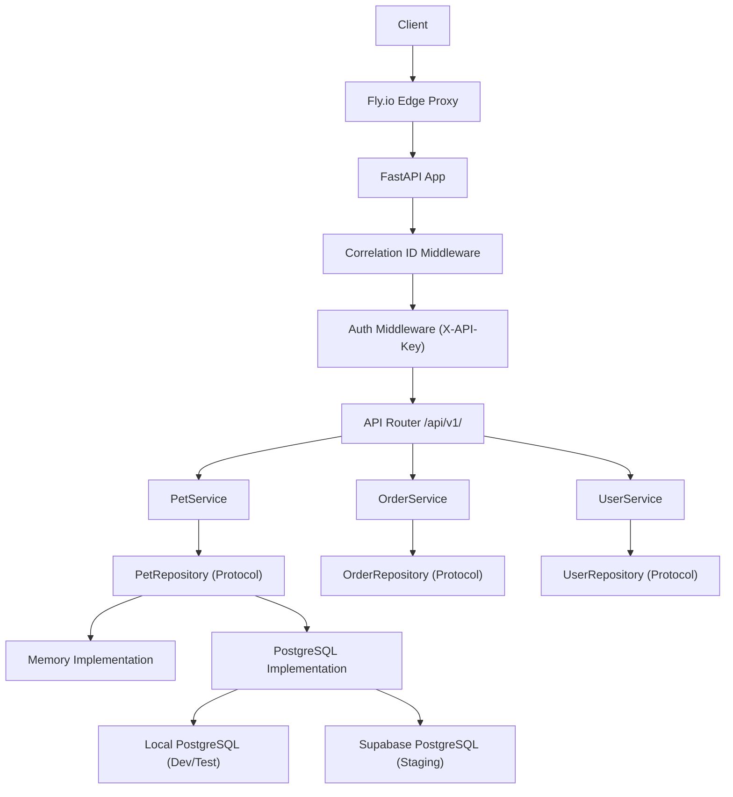
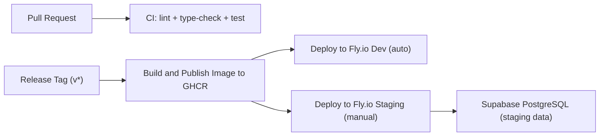

# Architecture

## Service Layers

## CI/CD Flow

## Component Overview

| Layer | Component | Responsibility |
|---|---|---|
| Transport | FastAPI / Uvicorn | HTTP routing, request/response handling |
| Middleware | CorrelationId, Auth | Cross-cutting concerns |
| API | v1 routers | Endpoint definitions, request validation |
| Service | PetService, etc. | Business logic |
| Repository | Memory / Postgres | Data persistence abstraction |
| ORM | SQLAlchemy 2.x async | Database mapping |
| Data Stores | Local PostgreSQL, Supabase PostgreSQL | Environment-specific persistence backends |
| Deployment | GitHub Actions, GHCR, Fly.io | Build, publish, and runtime hosting pipeline |
| Config | Pydantic Settings | Environment-based configuration |
